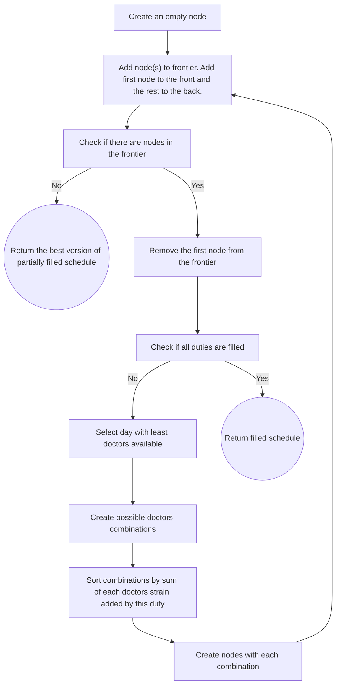

# MedDuties algorithm microservice

## Overview
This is a revision of a duty-setting algorithm from MedDuties app ([repo](https://github.com/marcinbogdanowicz/MedDuties)). The original algorithm was written in JavaScript in 2022/23. I decided to translate the code to Python and refactor it using best OOP practices.

This repo contains a microservice called `algorithm`, designed for creating monthly schedules of medical duties
for 1 - 3 doctors per duty. The service is responsible for doctors' preferences validation and setting duties. It utilizes a **custom best-first search AI algorithm**.

Service implements localization and is able to return user facing messages (preferences validation outcome) in Polish or English.

**Tech stack**: Python 3.12, Flask, gunicorn, pydantic, Babel, Docker, docker compose

## Installation

The repo contains a basic **development** docker compose setup. In order to run the project:
- clone this repo
- `cd` to the project root
- `docker compose up -d --build`

The server will listen at `http://localhost:5000/`

## Usage

### `POST /set_duties`

Validate if duties can be set and attempt filling the schedule if no errors were found.

<details>
<summary>Example request data</summary>

```json
{
    "year": 2025,
    "month": 1,
    "doctors_per_duty": 3,
    "doctors": [
        {
            "pk": 1,
            "name": "David Parker",
            "preferences": {
                "exceptions": [],
                "requested_days": [],
                "preferred_weekdays": [0, 1, 2, 3, 4, 5, 6],
                "preferred_positions": [1, 2, 3],
                "maximum_accepted_duties": 15
            },
            "last_month_duties": [],
            "next_month_duties": []
        },
        {
            "pk": 2,
            "name": "Katie Collins",
            "preferences": {
                "exceptions": [],
                "requested_days": [],
                "preferred_weekdays": [0, 1, 2, 3, 4, 5, 6],
                "preferred_positions": [1, 2, 3],
                "maximum_accepted_duties": 15
            },
            "last_month_duties": [],
            "next_month_duties": []
        },
        {
            "pk": 3,
            "name": "Elizabeth Porter",
            "preferences": {
                "exceptions": [],
                "requested_days": [],
                "preferred_weekdays": [0, 1, 2, 3, 4, 5, 6],
                "preferred_positions": [1, 2, 3],
                "maximum_accepted_duties": 15
            },
            "last_month_duties": [],
            "next_month_duties": []
        },
        {
            "pk": 4,
            "name": "Jennifer Norman",
            "preferences": {
                "exceptions": [],
                "requested_days": [],
                "preferred_weekdays": [0, 1, 2, 3, 4, 5, 6],
                "preferred_positions": [1, 2, 3],
                "maximum_accepted_duties": 15
            },
            "last_month_duties": [],
            "next_month_duties": []
        },
        {
            "pk": 5,
            "name": "Eric Stanley",
            "preferences": {
                "exceptions": [],
                "requested_days": [],
                "preferred_weekdays": [0, 1, 2, 3, 4, 5, 6],
                "preferred_positions": [1, 2, 3],
                "maximum_accepted_duties": 15
            },
            "last_month_duties": [],
            "next_month_duties": []
        },
        {
            "pk": 6,
            "name": "James Stevens",
            "preferences": {
                "exceptions": [],
                "requested_days": [],
                "preferred_weekdays": [0, 1, 2, 3, 4, 5, 6],
                "preferred_positions": [1, 2, 3],
                "maximum_accepted_duties": 15
            },
            "last_month_duties": [],
            "next_month_duties": []
        },
        {
            "pk": 7,
            "name": "Lori King",
            "preferences": {
                "exceptions": [],
                "requested_days": [],
                "preferred_weekdays": [0, 1, 2, 3, 4, 5, 6],
                "preferred_positions": [1, 2, 3],
                "maximum_accepted_duties": 15
            },
            "last_month_duties": [],
            "next_month_duties": []
        },
        {
            "pk": 8,
            "name": "David West",
            "preferences": {
                "exceptions": [],
                "requested_days": [],
                "preferred_weekdays": [0, 1, 2, 3, 4, 5, 6],
                "preferred_positions": [1, 2, 3],
                "maximum_accepted_duties": 15
            },
            "last_month_duties": [],
            "next_month_duties": []
        },
        {
            "pk": 9,
            "name": "Kimberly White",
            "preferences": {
                "exceptions": [],
                "requested_days": [],
                "preferred_weekdays": [0, 1, 2, 3, 4, 5, 6],
                "preferred_positions": [1, 2, 3],
                "maximum_accepted_duties": 15
            },
            "last_month_duties": [],
            "next_month_duties": []
        },
        {
            "pk": 10,
            "name": "Lisa Gordon",
            "preferences": {
                "exceptions": [],
                "requested_days": [],
                "preferred_weekdays": [0, 1, 2, 3, 4, 5, 6],
                "preferred_positions": [1, 2, 3],
                "maximum_accepted_duties": 15
            },
            "last_month_duties": [],
            "next_month_duties": []
        }
    ],
    "duties": [
        {
            "pk": 1,
            "doctor": 9,
            "day": 1,
            "position": 1,
            "strain_points": 140,
            "set_by_user": true
        },
        {
            "pk": 2,
            "doctor": null,
            "day": 1,
            "position": 2,
            "strain_points": 140,
            "set_by_user": false
        },
        {
            "pk": 3,
            "doctor": null,
            "day": 1,
            "position": 3,
            "strain_points": 140,
            "set_by_user": false
        },
        {
            "pk": 4,
            "doctor": null,
            "day": 2,
            "position": 1,
            "strain_points": 70,
            "set_by_user": false
        },
        {
            "pk": 5,
            "doctor": null,
            "day": 2,
            "position": 2,
            "strain_points": 70,
            "set_by_user": false
        },
        {
            "pk": 6,
            "doctor": null,
            "day": 2,
            "position": 3,
            "strain_points": 70,
            "set_by_user": false
        },
        {
            "pk": 7,
            "doctor": 4,
            "day": 3,
            "position": 1,
            "strain_points": 90,
            "set_by_user": true
        },
        {
            "pk": 8,
            "doctor": null,
            "day": 3,
            "position": 2,
            "strain_points": 90,
            "set_by_user": false
        },
        {
            "pk": 9,
            "doctor": null,
            "day": 3,
            "position": 3,
            "strain_points": 90,
            "set_by_user": false
        },
        {
            "pk": 10,
            "doctor": null,
            "day": 4,
            "position": 1,
            "strain_points": 110,
            "set_by_user": false
        },
        {
            "pk": 11,
            "doctor": null,
            "day": 4,
            "position": 2,
            "strain_points": 110,
            "set_by_user": false
        },
        {
            "pk": 12,
            "doctor": null,
            "day": 4,
            "position": 3,
            "strain_points": 110,
            "set_by_user": false
        },
        {
            "pk": 13,
            "doctor": 1,
            "day": 5,
            "position": 1,
            "strain_points": 100,
            "set_by_user": true
        },
        {
            "pk": 14,
            "doctor": null,
            "day": 5,
            "position": 2,
            "strain_points": 100,
            "set_by_user": false
        },
        {
            "pk": 15,
            "doctor": null,
            "day": 5,
            "position": 3,
            "strain_points": 100,
            "set_by_user": false
        },
        {
            "pk": 16,
            "doctor": null,
            "day": 6,
            "position": 1,
            "strain_points": 140,
            "set_by_user": false
        },
        {
            "pk": 17,
            "doctor": null,
            "day": 6,
            "position": 2,
            "strain_points": 140,
            "set_by_user": false
        },
        {
            "pk": 18,
            "doctor": null,
            "day": 6,
            "position": 3,
            "strain_points": 140,
            "set_by_user": false
        },
        {
            "pk": 19,
            "doctor": null,
            "day": 7,
            "position": 1,
            "strain_points": 80,
            "set_by_user": false
        },
        {
            "pk": 20,
            "doctor": null,
            "day": 7,
            "position": 2,
            "strain_points": 80,
            "set_by_user": false
        },
        {
            "pk": 21,
            "doctor": null,
            "day": 7,
            "position": 3,
            "strain_points": 80,
            "set_by_user": false
        },
        {
            "pk": 22,
            "doctor": null,
            "day": 8,
            "position": 1,
            "strain_points": 80,
            "set_by_user": false
        },
        {
            "pk": 23,
            "doctor": null,
            "day": 8,
            "position": 2,
            "strain_points": 80,
            "set_by_user": false
        },
        {
            "pk": 24,
            "doctor": null,
            "day": 8,
            "position": 3,
            "strain_points": 80,
            "set_by_user": false
        },
        {
            "pk": 25,
            "doctor": null,
            "day": 9,
            "position": 1,
            "strain_points": 70,
            "set_by_user": false
        },
        {
            "pk": 26,
            "doctor": null,
            "day": 9,
            "position": 2,
            "strain_points": 70,
            "set_by_user": false
        },
        {
            "pk": 27,
            "doctor": null,
            "day": 9,
            "position": 3,
            "strain_points": 70,
            "set_by_user": false
        },
        {
            "pk": 28,
            "doctor": null,
            "day": 10,
            "position": 1,
            "strain_points": 90,
            "set_by_user": false
        },
        {
            "pk": 29,
            "doctor": null,
            "day": 10,
            "position": 2,
            "strain_points": 90,
            "set_by_user": false
        },
        {
            "pk": 30,
            "doctor": null,
            "day": 10,
            "position": 3,
            "strain_points": 90,
            "set_by_user": false
        },
        {
            "pk": 31,
            "doctor": null,
            "day": 11,
            "position": 1,
            "strain_points": 110,
            "set_by_user": false
        },
        {
            "pk": 32,
            "doctor": null,
            "day": 11,
            "position": 2,
            "strain_points": 110,
            "set_by_user": false
        },
        {
            "pk": 33,
            "doctor": null,
            "day": 11,
            "position": 3,
            "strain_points": 110,
            "set_by_user": false
        },
        {
            "pk": 34,
            "doctor": null,
            "day": 12,
            "position": 1,
            "strain_points": 100,
            "set_by_user": false
        },
        {
            "pk": 35,
            "doctor": null,
            "day": 12,
            "position": 2,
            "strain_points": 100,
            "set_by_user": false
        },
        {
            "pk": 36,
            "doctor": null,
            "day": 12,
            "position": 3,
            "strain_points": 100,
            "set_by_user": false
        },
        {
            "pk": 37,
            "doctor": null,
            "day": 13,
            "position": 1,
            "strain_points": 80,
            "set_by_user": false
        },
        {
            "pk": 38,
            "doctor": null,
            "day": 13,
            "position": 2,
            "strain_points": 80,
            "set_by_user": false
        },
        {
            "pk": 39,
            "doctor": null,
            "day": 13,
            "position": 3,
            "strain_points": 80,
            "set_by_user": false
        },
        {
            "pk": 40,
            "doctor": null,
            "day": 14,
            "position": 1,
            "strain_points": 80,
            "set_by_user": false
        },
        {
            "pk": 41,
            "doctor": null,
            "day": 14,
            "position": 2,
            "strain_points": 80,
            "set_by_user": false
        },
        {
            "pk": 42,
            "doctor": null,
            "day": 14,
            "position": 3,
            "strain_points": 80,
            "set_by_user": false
        },
        {
            "pk": 43,
            "doctor": null,
            "day": 15,
            "position": 1,
            "strain_points": 80,
            "set_by_user": false
        },
        {
            "pk": 44,
            "doctor": null,
            "day": 15,
            "position": 2,
            "strain_points": 80,
            "set_by_user": false
        },
        {
            "pk": 45,
            "doctor": null,
            "day": 15,
            "position": 3,
            "strain_points": 80,
            "set_by_user": false
        },
        {
            "pk": 46,
            "doctor": null,
            "day": 16,
            "position": 1,
            "strain_points": 70,
            "set_by_user": false
        },
        {
            "pk": 47,
            "doctor": null,
            "day": 16,
            "position": 2,
            "strain_points": 70,
            "set_by_user": false
        },
        {
            "pk": 48,
            "doctor": null,
            "day": 16,
            "position": 3,
            "strain_points": 70,
            "set_by_user": false
        },
        {
            "pk": 49,
            "doctor": null,
            "day": 17,
            "position": 1,
            "strain_points": 90,
            "set_by_user": false
        },
        {
            "pk": 50,
            "doctor": null,
            "day": 17,
            "position": 2,
            "strain_points": 90,
            "set_by_user": false
        },
        {
            "pk": 51,
            "doctor": null,
            "day": 17,
            "position": 3,
            "strain_points": 90,
            "set_by_user": false
        },
        {
            "pk": 52,
            "doctor": null,
            "day": 18,
            "position": 1,
            "strain_points": 110,
            "set_by_user": false
        },
        {
            "pk": 53,
            "doctor": null,
            "day": 18,
            "position": 2,
            "strain_points": 110,
            "set_by_user": false
        },
        {
            "pk": 54,
            "doctor": null,
            "day": 18,
            "position": 3,
            "strain_points": 110,
            "set_by_user": false
        },
        {
            "pk": 55,
            "doctor": null,
            "day": 19,
            "position": 1,
            "strain_points": 100,
            "set_by_user": false
        },
        {
            "pk": 56,
            "doctor": null,
            "day": 19,
            "position": 2,
            "strain_points": 100,
            "set_by_user": false
        },
        {
            "pk": 57,
            "doctor": null,
            "day": 19,
            "position": 3,
            "strain_points": 100,
            "set_by_user": false
        },
        {
            "pk": 58,
            "doctor": null,
            "day": 20,
            "position": 1,
            "strain_points": 80,
            "set_by_user": false
        },
        {
            "pk": 59,
            "doctor": null,
            "day": 20,
            "position": 2,
            "strain_points": 80,
            "set_by_user": false
        },
        {
            "pk": 60,
            "doctor": null,
            "day": 20,
            "position": 3,
            "strain_points": 80,
            "set_by_user": false
        },
        {
            "pk": 61,
            "doctor": null,
            "day": 21,
            "position": 1,
            "strain_points": 80,
            "set_by_user": false
        },
        {
            "pk": 62,
            "doctor": null,
            "day": 21,
            "position": 2,
            "strain_points": 80,
            "set_by_user": false
        },
        {
            "pk": 63,
            "doctor": null,
            "day": 21,
            "position": 3,
            "strain_points": 80,
            "set_by_user": false
        },
        {
            "pk": 64,
            "doctor": null,
            "day": 22,
            "position": 1,
            "strain_points": 80,
            "set_by_user": false
        },
        {
            "pk": 65,
            "doctor": null,
            "day": 22,
            "position": 2,
            "strain_points": 80,
            "set_by_user": false
        },
        {
            "pk": 66,
            "doctor": null,
            "day": 22,
            "position": 3,
            "strain_points": 80,
            "set_by_user": false
        },
        {
            "pk": 67,
            "doctor": null,
            "day": 23,
            "position": 1,
            "strain_points": 70,
            "set_by_user": false
        },
        {
            "pk": 68,
            "doctor": null,
            "day": 23,
            "position": 2,
            "strain_points": 70,
            "set_by_user": false
        },
        {
            "pk": 69,
            "doctor": null,
            "day": 23,
            "position": 3,
            "strain_points": 70,
            "set_by_user": false
        },
        {
            "pk": 70,
            "doctor": null,
            "day": 24,
            "position": 1,
            "strain_points": 90,
            "set_by_user": false
        },
        {
            "pk": 71,
            "doctor": null,
            "day": 24,
            "position": 2,
            "strain_points": 90,
            "set_by_user": false
        },
        {
            "pk": 72,
            "doctor": null,
            "day": 24,
            "position": 3,
            "strain_points": 90,
            "set_by_user": false
        },
        {
            "pk": 73,
            "doctor": null,
            "day": 25,
            "position": 1,
            "strain_points": 110,
            "set_by_user": false
        },
        {
            "pk": 74,
            "doctor": null,
            "day": 25,
            "position": 2,
            "strain_points": 110,
            "set_by_user": false
        },
        {
            "pk": 75,
            "doctor": null,
            "day": 25,
            "position": 3,
            "strain_points": 110,
            "set_by_user": false
        },
        {
            "pk": 76,
            "doctor": null,
            "day": 26,
            "position": 1,
            "strain_points": 100,
            "set_by_user": false
        },
        {
            "pk": 77,
            "doctor": null,
            "day": 26,
            "position": 2,
            "strain_points": 100,
            "set_by_user": false
        },
        {
            "pk": 78,
            "doctor": null,
            "day": 26,
            "position": 3,
            "strain_points": 100,
            "set_by_user": false
        },
        {
            "pk": 79,
            "doctor": null,
            "day": 27,
            "position": 1,
            "strain_points": 80,
            "set_by_user": false
        },
        {
            "pk": 80,
            "doctor": null,
            "day": 27,
            "position": 2,
            "strain_points": 80,
            "set_by_user": false
        },
        {
            "pk": 81,
            "doctor": null,
            "day": 27,
            "position": 3,
            "strain_points": 80,
            "set_by_user": false
        },
        {
            "pk": 82,
            "doctor": null,
            "day": 28,
            "position": 1,
            "strain_points": 80,
            "set_by_user": false
        },
        {
            "pk": 83,
            "doctor": null,
            "day": 28,
            "position": 2,
            "strain_points": 80,
            "set_by_user": false
        },
        {
            "pk": 84,
            "doctor": null,
            "day": 28,
            "position": 3,
            "strain_points": 80,
            "set_by_user": false
        },
        {
            "pk": 85,
            "doctor": null,
            "day": 29,
            "position": 1,
            "strain_points": 80,
            "set_by_user": false
        },
        {
            "pk": 86,
            "doctor": null,
            "day": 29,
            "position": 2,
            "strain_points": 80,
            "set_by_user": false
        },
        {
            "pk": 87,
            "doctor": null,
            "day": 29,
            "position": 3,
            "strain_points": 80,
            "set_by_user": false
        },
        {
            "pk": 88,
            "doctor": null,
            "day": 30,
            "position": 1,
            "strain_points": 70,
            "set_by_user": false
        },
        {
            "pk": 89,
            "doctor": null,
            "day": 30,
            "position": 2,
            "strain_points": 70,
            "set_by_user": false
        },
        {
            "pk": 90,
            "doctor": null,
            "day": 30,
            "position": 3,
            "strain_points": 70,
            "set_by_user": false
        },
        {
            "pk": 91,
            "doctor": null,
            "day": 31,
            "position": 1,
            "strain_points": 90,
            "set_by_user": false
        },
        {
            "pk": 92,
            "doctor": null,
            "day": 31,
            "position": 2,
            "strain_points": 90,
            "set_by_user": false
        },
        {
            "pk": 93,
            "doctor": null,
            "day": 31,
            "position": 3,
            "strain_points": 90,
            "set_by_user": false
        }
    ],
    "locale": "en"
}
```
</details>

<details>
<summary>Example response data</summary>

```json
{
    "duties": [
        {
            "day": 1,
            "doctor": 2,
            "pk": null,
            "position": 1,
            "set_by_user": false,
            "strain_points": 140
        },
        {
            "day": 1,
            "doctor": 5,
            "pk": 1,
            "position": 2,
            "set_by_user": true,
            "strain_points": 20
        },
        {
            "day": 2,
            "doctor": 4,
            "pk": null,
            "position": 1,
            "set_by_user": false,
            "strain_points": 70
        },
        {
            "day": 2,
            "doctor": 3,
            "pk": null,
            "position": 2,
            "set_by_user": false,
            "strain_points": 70
        },
        {
            "day": 3,
            "doctor": 1,
            "pk": 2,
            "position": 1,
            "set_by_user": true,
            "strain_points": 15
        },
        {
            "day": 3,
            "doctor": 5,
            "pk": null,
            "position": 2,
            "set_by_user": false,
            "strain_points": 90
        },
        {
            "day": 4,
            "doctor": 2,
            "pk": null,
            "position": 1,
            "set_by_user": false,
            "strain_points": 110
        },
        {
            "day": 4,
            "doctor": 3,
            "pk": null,
            "position": 2,
            "set_by_user": false,
            "strain_points": 110
        },
        {
            "day": 5,
            "doctor": 1,
            "pk": null,
            "position": 1,
            "set_by_user": false,
            "strain_points": 100
        },
        {
            "day": 5,
            "doctor": 5,
            "pk": null,
            "position": 2,
            "set_by_user": false,
            "strain_points": 100
        },
        {
            "day": 6,
            "doctor": 4,
            "pk": null,
            "position": 1,
            "set_by_user": false,
            "strain_points": 140
        },
        {
            "day": 6,
            "doctor": 2,
            "pk": null,
            "position": 2,
            "set_by_user": false,
            "strain_points": 140
        },
        {
            "day": 7,
            "doctor": 1,
            "pk": null,
            "position": 1,
            "set_by_user": false,
            "strain_points": 80
        },
        {
            "day": 7,
            "doctor": 3,
            "pk": null,
            "position": 2,
            "set_by_user": false,
            "strain_points": 80
        },
        {
            "day": 8,
            "doctor": 4,
            "pk": null,
            "position": 1,
            "set_by_user": false,
            "strain_points": 80
        },
        {
            "day": 8,
            "doctor": 5,
            "pk": null,
            "position": 2,
            "set_by_user": false,
            "strain_points": 80
        },
        {
            "day": 9,
            "doctor": 2,
            "pk": null,
            "position": 1,
            "set_by_user": false,
            "strain_points": 70
        },
        {
            "day": 9,
            "doctor": 3,
            "pk": null,
            "position": 2,
            "set_by_user": false,
            "strain_points": 70
        },
        {
            "day": 10,
            "doctor": 4,
            "pk": null,
            "position": 1,
            "set_by_user": false,
            "strain_points": 90
        },
        {
            "day": 10,
            "doctor": 1,
            "pk": null,
            "position": 2,
            "set_by_user": false,
            "strain_points": 90
        },
        {
            "day": 11,
            "doctor": 5,
            "pk": null,
            "position": 1,
            "set_by_user": false,
            "strain_points": 110
        },
        {
            "day": 11,
            "doctor": 2,
            "pk": null,
            "position": 2,
            "set_by_user": false,
            "strain_points": 110
        },
        {
            "day": 12,
            "doctor": 4,
            "pk": null,
            "position": 1,
            "set_by_user": false,
            "strain_points": 100
        },
        {
            "day": 12,
            "doctor": 1,
            "pk": null,
            "position": 2,
            "set_by_user": false,
            "strain_points": 100
        },
        {
            "day": 13,
            "doctor": 5,
            "pk": null,
            "position": 1,
            "set_by_user": false,
            "strain_points": 80
        },
        {
            "day": 13,
            "doctor": 3,
            "pk": null,
            "position": 2,
            "set_by_user": false,
            "strain_points": 80
        },
        {
            "day": 14,
            "doctor": 2,
            "pk": null,
            "position": 1,
            "set_by_user": false,
            "strain_points": 80
        },
        {
            "day": 14,
            "doctor": 1,
            "pk": null,
            "position": 2,
            "set_by_user": false,
            "strain_points": 80
        },
        {
            "day": 15,
            "doctor": 3,
            "pk": null,
            "position": 1,
            "set_by_user": false,
            "strain_points": 80
        },
        {
            "day": 15,
            "doctor": 4,
            "pk": null,
            "position": 2,
            "set_by_user": false,
            "strain_points": 80
        },
        {
            "day": 16,
            "doctor": 2,
            "pk": null,
            "position": 1,
            "set_by_user": false,
            "strain_points": 70
        },
        {
            "day": 16,
            "doctor": 5,
            "pk": null,
            "position": 2,
            "set_by_user": false,
            "strain_points": 70
        },
        {
            "day": 17,
            "doctor": 3,
            "pk": null,
            "position": 1,
            "set_by_user": false,
            "strain_points": 90
        },
        {
            "day": 17,
            "doctor": 4,
            "pk": null,
            "position": 2,
            "set_by_user": false,
            "strain_points": 90
        },
        {
            "day": 18,
            "doctor": 1,
            "pk": null,
            "position": 1,
            "set_by_user": false,
            "strain_points": 110
        },
        {
            "day": 18,
            "doctor": 5,
            "pk": null,
            "position": 2,
            "set_by_user": false,
            "strain_points": 110
        },
        {
            "day": 19,
            "doctor": 3,
            "pk": null,
            "position": 1,
            "set_by_user": false,
            "strain_points": 100
        },
        {
            "day": 19,
            "doctor": 4,
            "pk": null,
            "position": 2,
            "set_by_user": false,
            "strain_points": 100
        },
        {
            "day": 20,
            "doctor": 1,
            "pk": null,
            "position": 1,
            "set_by_user": false,
            "strain_points": 80
        },
        {
            "day": 20,
            "doctor": 2,
            "pk": null,
            "position": 2,
            "set_by_user": false,
            "strain_points": 80
        },
        {
            "day": 21,
            "doctor": 5,
            "pk": null,
            "position": 1,
            "set_by_user": false,
            "strain_points": 80
        },
        {
            "day": 21,
            "doctor": 3,
            "pk": null,
            "position": 2,
            "set_by_user": false,
            "strain_points": 80
        },
        {
            "day": 22,
            "doctor": 2,
            "pk": null,
            "position": 1,
            "set_by_user": false,
            "strain_points": 80
        },
        {
            "day": 22,
            "doctor": 4,
            "pk": null,
            "position": 2,
            "set_by_user": false,
            "strain_points": 80
        },
        {
            "day": 23,
            "doctor": 1,
            "pk": null,
            "position": 1,
            "set_by_user": false,
            "strain_points": 70
        },
        {
            "day": 23,
            "doctor": 5,
            "pk": null,
            "position": 2,
            "set_by_user": false,
            "strain_points": 70
        },
        {
            "day": 24,
            "doctor": 4,
            "pk": null,
            "position": 1,
            "set_by_user": false,
            "strain_points": 90
        },
        {
            "day": 24,
            "doctor": 3,
            "pk": null,
            "position": 2,
            "set_by_user": false,
            "strain_points": 90
        },
        {
            "day": 25,
            "doctor": 2,
            "pk": null,
            "position": 1,
            "set_by_user": false,
            "strain_points": 110
        },
        {
            "day": 25,
            "doctor": 1,
            "pk": null,
            "position": 2,
            "set_by_user": false,
            "strain_points": 110
        },
        {
            "day": 26,
            "doctor": 4,
            "pk": null,
            "position": 1,
            "set_by_user": false,
            "strain_points": 100
        },
        {
            "day": 26,
            "doctor": 3,
            "pk": null,
            "position": 2,
            "set_by_user": false,
            "strain_points": 100
        },
        {
            "day": 27,
            "doctor": 5,
            "pk": null,
            "position": 1,
            "set_by_user": false,
            "strain_points": 80
        },
        {
            "day": 27,
            "doctor": 2,
            "pk": null,
            "position": 2,
            "set_by_user": false,
            "strain_points": 80
        },
        {
            "day": 28,
            "doctor": 4,
            "pk": null,
            "position": 1,
            "set_by_user": false,
            "strain_points": 80
        },
        {
            "day": 28,
            "doctor": 1,
            "pk": null,
            "position": 2,
            "set_by_user": false,
            "strain_points": 80
        },
        {
            "day": 29,
            "doctor": 5,
            "pk": null,
            "position": 1,
            "set_by_user": false,
            "strain_points": 80
        },
        {
            "day": 29,
            "doctor": 3,
            "pk": null,
            "position": 2,
            "set_by_user": false,
            "strain_points": 80
        },
        {
            "day": 30,
            "doctor": 1,
            "pk": null,
            "position": 1,
            "set_by_user": false,
            "strain_points": 70
        },
        {
            "day": 30,
            "doctor": 2,
            "pk": null,
            "position": 2,
            "set_by_user": false,
            "strain_points": 70
        },
        {
            "day": 31,
            "doctor": 4,
            "pk": null,
            "position": 1,
            "set_by_user": false,
            "strain_points": 90
        },
        {
            "day": 31,
            "doctor": 3,
            "pk": null,
            "position": 2,
            "set_by_user": false,
            "strain_points": 90
        }
    ],
    "errors": [],
    "were_all_duties_set": true,
    "were_any_duties_set": true
}
```
</details>

### `POST /validate_duties_can_be_set`

Runs the same validators as before setting duties, but without attempting to set duties if there are no errors.

Empty `"errors"` list indicates that no errors were found.

<details>
<summary>Example request data</summary>

```json
{
    "year": 2025,
    "month": 1,
    "doctors_per_duty": 2,
    "doctors": [
        {
            "pk": 1,
            "name": "Elizabeth Davis",
            "preferences": {
                "exceptions": [11, 12, 13],
                "requested_days": [10, 14],
                "preferred_weekdays": [0, 1, 3, 4, 5, 6],
                "preferred_positions": [1, 2],
                "maximum_accepted_duties": 15
            },
            "last_month_duties": [19, 24],
            "next_month_duties": [1, 17]
        },
        {
            "pk": 2,
            "name": "Dustin Bray",
            "preferences": {
                "exceptions": [],
                "requested_days": [],
                "preferred_weekdays": [0, 1, 2, 3, 4, 5, 6],
                "preferred_positions": [1, 2],
                "maximum_accepted_duties": 15
            },
            "last_month_duties": [],
            "next_month_duties": []
        },
        {
            "pk": 3,
            "name": "Matthew Garrett",
            "preferences": {
                "exceptions": [],
                "requested_days": [],
                "preferred_weekdays": [0, 1, 2, 3, 4, 5, 6],
                "preferred_positions": [1, 2],
                "maximum_accepted_duties": 15
            },
            "last_month_duties": [],
            "next_month_duties": []
        },
        {
            "pk": 4,
            "name": "Tammy Ward",
            "preferences": {
                "exceptions": [],
                "requested_days": [],
                "preferred_weekdays": [0, 1, 2, 3, 4, 5, 6],
                "preferred_positions": [1, 2],
                "maximum_accepted_duties": 15
            },
            "last_month_duties": [],
            "next_month_duties": []
        },
        {
            "pk": 5,
            "name": "Connor Murphy",
            "preferences": {
                "exceptions": [],
                "requested_days": [],
                "preferred_weekdays": [0, 1, 2, 3, 4, 5, 6],
                "preferred_positions": [1, 2],
                "maximum_accepted_duties": 15
            },
            "last_month_duties": [],
            "next_month_duties": []
        }
    ],
    "duties": [
        {
            "pk": 1,
            "doctor": 5,
            "day": 1,
            "position": 2,
            "strain_points": 20,
            "set_by_user": true
        },
        {
            "pk": 2,
            "doctor": 1,
            "day": 3,
            "position": 1,
            "strain_points": 15,
            "set_by_user": true
        }
    ],
    "locale": "en"
}
```
</details>

<details>
<summary>Example response data</summary>

```json
{
    "errors": [
        "There are not enough doctors to fill all positions. Minimum required: 6, actual: 5.",
        "Doctor Connor Murphy requested double duties on the following days: 11 and 12, 12 and 13"
    ]
}
```
</details>

## Duty-setting principles

The algorithm will set duties based on the following monthly preferences of each doctor:
- dates, where they would like to be on duty,
- dates, where they cannot be on duty ('exceptions'),
- weekdays, where they generally cannot be on duty,
- duty positions they can be put on (numbered 1 to 3 - units need to map this to their specific positions),
- total number of duties they can accept in a month.

The duty-setting process is based on the following principles:
- no double duties (at least one day break between duties is required)
- doctors are expected to be given a day off after duty,
- each day is assigned a base strain value - here are day types ordered from highest strain:
    - holiday,
    - Saturday (since it leaves only Sunday to recover),
    - Sunday,
    - Friday (duty ends on Saturday morning, requiring to spend some part of the weekend on recovery),
    - Monday, Tuesday, Wednesday,
    - Thursday (since next day is off, duty on Thursday results in a longer weekend)
- the closer the duties are, the higher the strain (makes a difference up to 4 days apart),
- duty on each new weekend (Friday-Sunday) adds additional strain,
- doctor on duty on Friday should be on duty on Sunday if possible (to avoid interrupting other weekends),
- doctors having duty on Thursday should not be put on duty on Saturday if possible (as it cancels the longer weekend benefit).

The algorithm implements randomness to ensure that running it with the same input doesn't provide identical results. This allows to choose between a number of versions to account for subtle preferences or soft requirements, which cannot or should not be translated to code (e.g. for some reason doctor A might prefer Tuesdays over Wednesdays, but not to the extent of excluding Wednesdays - or when someone needs to have duties on 3 weekends in month, it 'would be good' if it wasn't doctor B, etc.).

## AI Algorithm overview

This is a rough schema of how the duties are set by the algorithm. Duties specifically requested by doctors are already set on this stage.



By adding the first node to the front of the frontier and the rest to the back, **streak search** pattern is achieved - this way we check the best node for day 1, than the best for day 2 etc. until we either fill the schedule or find a day with no options. In the latter case we check the second best for day 1, the best for day 2, etc. Consequent days combinations are dependent on previous one, so best for day 2 will be different for different combinations for day 1, etc.
