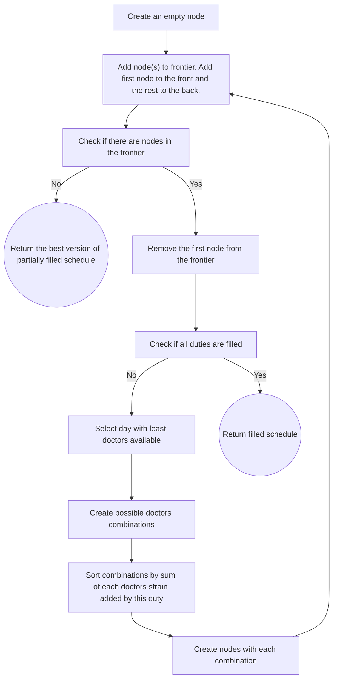

# MedDuties algorithm microservice

## Overview
This is a revision of a duty-setting algorithm from MedDuties app ([repo](https://github.com/marcinbogdanowicz/MedDuties)). The original algorithm was written in JavaScript in 2022/23. I decided to translate the code to Python and refactor it using best OOP practices.

This repo contains a microservice called `algorithm`, designed for creating monthly schedules of medical duties
for 1 - 3 doctors per duty. The service is responsible for doctors' preferences validation and setting duties. It utilizes a **custom best-first search AI algorithm**.

**Tech stack**: Python 3.12, Flask, pydantic, Docker, docker compose

## Installation

The repo contains a basic **development** docker compose setup. In order to run the project:
- clone this repo
- `cd` to the project root
- `docker compose up -d --build`

The server will listen at `http://localhost:5000/`

## Usage

The only endpoint is `POST /set_duties`.

<details>
<summary>Example request data</summary>

```json
{
    "year": 2025,
    "month": 1,
    "doctors_per_duty": 2,
    "doctors": [
        {
            "pk": 1,
            "name": "Elizabeth Davis",
            "preferences": {
                "exceptions": [11, 12, 13],
                "requested_days": [10, 14],
                "preferred_weekdays": [0, 1, 3, 4, 5, 6],
                "preferred_positions": [1, 2],
                "maximum_accepted_duties": 15
            },
            "last_month_duties": [19, 24],
            "next_month_duties": [1, 17]
        },
        {
            "pk": 2,
            "name": "Dustin Bray",
            "preferences": {
                "exceptions": [],
                "requested_days": [],
                "preferred_weekdays": [0, 1, 2, 3, 4, 5, 6],
                "preferred_positions": [1, 2],
                "maximum_accepted_duties": 15
            },
            "last_month_duties": [],
            "next_month_duties": []
        },
        {
            "pk": 3,
            "name": "Matthew Garrett",
            "preferences": {
                "exceptions": [],
                "requested_days": [],
                "preferred_weekdays": [0, 1, 2, 3, 4, 5, 6],
                "preferred_positions": [1, 2],
                "maximum_accepted_duties": 15
            },
            "last_month_duties": [],
            "next_month_duties": []
        },
        {
            "pk": 4,
            "name": "Tammy Ward",
            "preferences": {
                "exceptions": [],
                "requested_days": [],
                "preferred_weekdays": [0, 1, 2, 3, 4, 5, 6],
                "preferred_positions": [1, 2],
                "maximum_accepted_duties": 15
            },
            "last_month_duties": [],
            "next_month_duties": []
        },
        {
            "pk": 5,
            "name": "Connor Murphy",
            "preferences": {
                "exceptions": [],
                "requested_days": [],
                "preferred_weekdays": [0, 1, 2, 3, 4, 5, 6],
                "preferred_positions": [1, 2],
                "maximum_accepted_duties": 15
            },
            "last_month_duties": [],
            "next_month_duties": []
        }
    ],
    "duties": [
        {
            "pk": 1,
            "doctor_pk": 5,
            "day": 1,
            "position": 2,
            "strain_points": 20,
            "set_by_user": true
        },
        {
            "pk": 2,
            "doctor_pk": 1,
            "day": 3,
            "position": 1,
            "strain_points": 15,
            "set_by_user": true
        }
    ]
}
```
</details>

<details>
<summary>Example response data</summary>

```json
{
    "duties": [
        {
            "day": 1,
            "doctor_pk": 2,
            "pk": null,
            "position": 1,
            "set_by_user": false,
            "strain_points": 140
        },
        {
            "day": 1,
            "doctor_pk": 5,
            "pk": 1,
            "position": 2,
            "set_by_user": true,
            "strain_points": 20
        },
        {
            "day": 2,
            "doctor_pk": 4,
            "pk": null,
            "position": 1,
            "set_by_user": false,
            "strain_points": 70
        },
        {
            "day": 2,
            "doctor_pk": 3,
            "pk": null,
            "position": 2,
            "set_by_user": false,
            "strain_points": 70
        },
        {
            "day": 3,
            "doctor_pk": 1,
            "pk": 2,
            "position": 1,
            "set_by_user": true,
            "strain_points": 15
        },
        {
            "day": 3,
            "doctor_pk": 5,
            "pk": null,
            "position": 2,
            "set_by_user": false,
            "strain_points": 90
        },
        {
            "day": 4,
            "doctor_pk": 2,
            "pk": null,
            "position": 1,
            "set_by_user": false,
            "strain_points": 110
        },
        {
            "day": 4,
            "doctor_pk": 3,
            "pk": null,
            "position": 2,
            "set_by_user": false,
            "strain_points": 110
        },
        {
            "day": 5,
            "doctor_pk": 1,
            "pk": null,
            "position": 1,
            "set_by_user": false,
            "strain_points": 100
        },
        {
            "day": 5,
            "doctor_pk": 5,
            "pk": null,
            "position": 2,
            "set_by_user": false,
            "strain_points": 100
        },
        {
            "day": 6,
            "doctor_pk": 4,
            "pk": null,
            "position": 1,
            "set_by_user": false,
            "strain_points": 140
        },
        {
            "day": 6,
            "doctor_pk": 2,
            "pk": null,
            "position": 2,
            "set_by_user": false,
            "strain_points": 140
        },
        {
            "day": 7,
            "doctor_pk": 1,
            "pk": null,
            "position": 1,
            "set_by_user": false,
            "strain_points": 80
        },
        {
            "day": 7,
            "doctor_pk": 3,
            "pk": null,
            "position": 2,
            "set_by_user": false,
            "strain_points": 80
        },
        {
            "day": 8,
            "doctor_pk": 4,
            "pk": null,
            "position": 1,
            "set_by_user": false,
            "strain_points": 80
        },
        {
            "day": 8,
            "doctor_pk": 5,
            "pk": null,
            "position": 2,
            "set_by_user": false,
            "strain_points": 80
        },
        {
            "day": 9,
            "doctor_pk": 2,
            "pk": null,
            "position": 1,
            "set_by_user": false,
            "strain_points": 70
        },
        {
            "day": 9,
            "doctor_pk": 3,
            "pk": null,
            "position": 2,
            "set_by_user": false,
            "strain_points": 70
        },
        {
            "day": 10,
            "doctor_pk": 4,
            "pk": null,
            "position": 1,
            "set_by_user": false,
            "strain_points": 90
        },
        {
            "day": 10,
            "doctor_pk": 1,
            "pk": null,
            "position": 2,
            "set_by_user": false,
            "strain_points": 90
        },
        {
            "day": 11,
            "doctor_pk": 5,
            "pk": null,
            "position": 1,
            "set_by_user": false,
            "strain_points": 110
        },
        {
            "day": 11,
            "doctor_pk": 2,
            "pk": null,
            "position": 2,
            "set_by_user": false,
            "strain_points": 110
        },
        {
            "day": 12,
            "doctor_pk": 4,
            "pk": null,
            "position": 1,
            "set_by_user": false,
            "strain_points": 100
        },
        {
            "day": 12,
            "doctor_pk": 1,
            "pk": null,
            "position": 2,
            "set_by_user": false,
            "strain_points": 100
        },
        {
            "day": 13,
            "doctor_pk": 5,
            "pk": null,
            "position": 1,
            "set_by_user": false,
            "strain_points": 80
        },
        {
            "day": 13,
            "doctor_pk": 3,
            "pk": null,
            "position": 2,
            "set_by_user": false,
            "strain_points": 80
        },
        {
            "day": 14,
            "doctor_pk": 2,
            "pk": null,
            "position": 1,
            "set_by_user": false,
            "strain_points": 80
        },
        {
            "day": 14,
            "doctor_pk": 1,
            "pk": null,
            "position": 2,
            "set_by_user": false,
            "strain_points": 80
        },
        {
            "day": 15,
            "doctor_pk": 3,
            "pk": null,
            "position": 1,
            "set_by_user": false,
            "strain_points": 80
        },
        {
            "day": 15,
            "doctor_pk": 4,
            "pk": null,
            "position": 2,
            "set_by_user": false,
            "strain_points": 80
        },
        {
            "day": 16,
            "doctor_pk": 2,
            "pk": null,
            "position": 1,
            "set_by_user": false,
            "strain_points": 70
        },
        {
            "day": 16,
            "doctor_pk": 5,
            "pk": null,
            "position": 2,
            "set_by_user": false,
            "strain_points": 70
        },
        {
            "day": 17,
            "doctor_pk": 3,
            "pk": null,
            "position": 1,
            "set_by_user": false,
            "strain_points": 90
        },
        {
            "day": 17,
            "doctor_pk": 4,
            "pk": null,
            "position": 2,
            "set_by_user": false,
            "strain_points": 90
        },
        {
            "day": 18,
            "doctor_pk": 1,
            "pk": null,
            "position": 1,
            "set_by_user": false,
            "strain_points": 110
        },
        {
            "day": 18,
            "doctor_pk": 5,
            "pk": null,
            "position": 2,
            "set_by_user": false,
            "strain_points": 110
        },
        {
            "day": 19,
            "doctor_pk": 3,
            "pk": null,
            "position": 1,
            "set_by_user": false,
            "strain_points": 100
        },
        {
            "day": 19,
            "doctor_pk": 4,
            "pk": null,
            "position": 2,
            "set_by_user": false,
            "strain_points": 100
        },
        {
            "day": 20,
            "doctor_pk": 1,
            "pk": null,
            "position": 1,
            "set_by_user": false,
            "strain_points": 80
        },
        {
            "day": 20,
            "doctor_pk": 2,
            "pk": null,
            "position": 2,
            "set_by_user": false,
            "strain_points": 80
        },
        {
            "day": 21,
            "doctor_pk": 5,
            "pk": null,
            "position": 1,
            "set_by_user": false,
            "strain_points": 80
        },
        {
            "day": 21,
            "doctor_pk": 3,
            "pk": null,
            "position": 2,
            "set_by_user": false,
            "strain_points": 80
        },
        {
            "day": 22,
            "doctor_pk": 2,
            "pk": null,
            "position": 1,
            "set_by_user": false,
            "strain_points": 80
        },
        {
            "day": 22,
            "doctor_pk": 4,
            "pk": null,
            "position": 2,
            "set_by_user": false,
            "strain_points": 80
        },
        {
            "day": 23,
            "doctor_pk": 1,
            "pk": null,
            "position": 1,
            "set_by_user": false,
            "strain_points": 70
        },
        {
            "day": 23,
            "doctor_pk": 5,
            "pk": null,
            "position": 2,
            "set_by_user": false,
            "strain_points": 70
        },
        {
            "day": 24,
            "doctor_pk": 4,
            "pk": null,
            "position": 1,
            "set_by_user": false,
            "strain_points": 90
        },
        {
            "day": 24,
            "doctor_pk": 3,
            "pk": null,
            "position": 2,
            "set_by_user": false,
            "strain_points": 90
        },
        {
            "day": 25,
            "doctor_pk": 2,
            "pk": null,
            "position": 1,
            "set_by_user": false,
            "strain_points": 110
        },
        {
            "day": 25,
            "doctor_pk": 1,
            "pk": null,
            "position": 2,
            "set_by_user": false,
            "strain_points": 110
        },
        {
            "day": 26,
            "doctor_pk": 4,
            "pk": null,
            "position": 1,
            "set_by_user": false,
            "strain_points": 100
        },
        {
            "day": 26,
            "doctor_pk": 3,
            "pk": null,
            "position": 2,
            "set_by_user": false,
            "strain_points": 100
        },
        {
            "day": 27,
            "doctor_pk": 5,
            "pk": null,
            "position": 1,
            "set_by_user": false,
            "strain_points": 80
        },
        {
            "day": 27,
            "doctor_pk": 2,
            "pk": null,
            "position": 2,
            "set_by_user": false,
            "strain_points": 80
        },
        {
            "day": 28,
            "doctor_pk": 4,
            "pk": null,
            "position": 1,
            "set_by_user": false,
            "strain_points": 80
        },
        {
            "day": 28,
            "doctor_pk": 1,
            "pk": null,
            "position": 2,
            "set_by_user": false,
            "strain_points": 80
        },
        {
            "day": 29,
            "doctor_pk": 5,
            "pk": null,
            "position": 1,
            "set_by_user": false,
            "strain_points": 80
        },
        {
            "day": 29,
            "doctor_pk": 3,
            "pk": null,
            "position": 2,
            "set_by_user": false,
            "strain_points": 80
        },
        {
            "day": 30,
            "doctor_pk": 1,
            "pk": null,
            "position": 1,
            "set_by_user": false,
            "strain_points": 70
        },
        {
            "day": 30,
            "doctor_pk": 2,
            "pk": null,
            "position": 2,
            "set_by_user": false,
            "strain_points": 70
        },
        {
            "day": 31,
            "doctor_pk": 4,
            "pk": null,
            "position": 1,
            "set_by_user": false,
            "strain_points": 90
        },
        {
            "day": 31,
            "doctor_pk": 3,
            "pk": null,
            "position": 2,
            "set_by_user": false,
            "strain_points": 90
        }
    ],
    "errors": [],
    "were_all_duties_set": true,
    "were_any_duties_set": true
}
```
</details>

## AI Algorithm overview

This is a rough schema of how the duties are set by the algorithm. Duties specifically requested by doctors are already set on this stage.



By adding the first node to the front of the frontier and the rest to the back, **streak search** pattern is achieved - this way we check the best node for day 1, than the best for day 2 etc. until we either fill the schedule or find a day with no options. In the latter case we check the second best for day 1, the best for day 2. Consequent days combinations are dependent on previous one, so best for day 2 will be different for different combinations for day 1, etc.